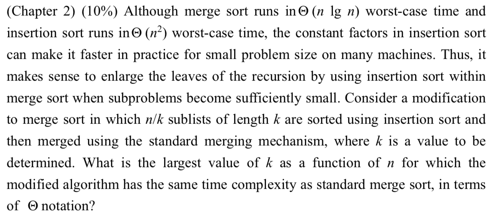

# 2017 Exam 1

## Q1. 

## Q2. 

## Q3.

因為分析演算法用 Best case 沒有意義，因為 best case 發生機率很低，且為了最壞打算，我們希望找到 avg case / worst case 來分析演算法

## Q4.

No, $$4^n\ is\ faster\ than\ 2^n$$ 

## Q5.

因為 n 很大的時候， $$\frac{n}{2}+13\ 很接近\ \frac{n}{2}$$ ，猜 $$T(n)=O(n\ lg\ n)$$ 

## Q6. 

二的延伸：

$$
if:\ f(n)=\theta(n^{log_b\ a} \times lg\ ^kn)\\ then,\  T(n)=\theta(n^{log_b\ a} \times lg\ ^{k+1}n)
$$

## Q7. 

## Q8. 

## Q9. 

## Q10. 

## Q11.

## Q12. 

